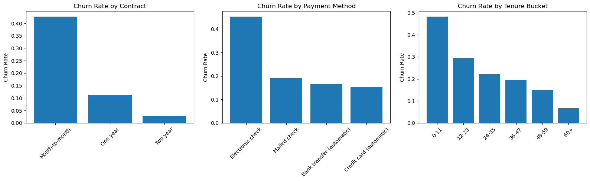
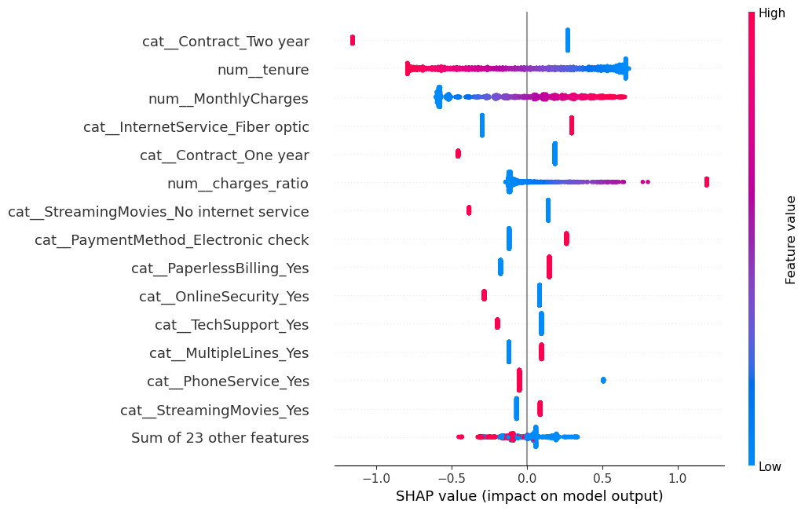
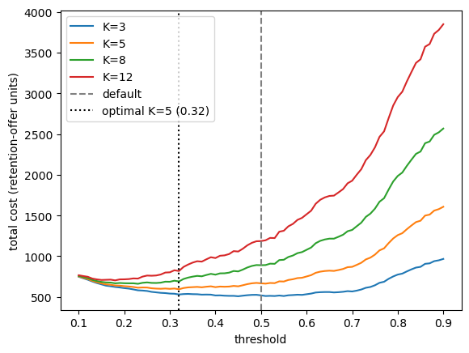

# telco-churn-classification

`pandas` · `numpy` · `scikit-learn` (`Pipeline`, `ColumnTransformer`, `StratifiedKFold`,
`GridSearchCV`) · `xgboost` · `shap` · class-imbalance handling · leakage-safe
preprocessing · cost-based threshold selection · model explainability

Predicting customer churn on the IBM Telco Customer Churn dataset: the retention problem a
subscription business solves in production. Given a customer's contract, billing, and
service attributes, estimate how likely they are to leave so a retention team can act
before they do. This is the classification counterpart to `london-airbnb-regression`,
with an explicit class-imbalance decision, a business-cost threshold analysis, and SHAP
explainability that the regression project didn't require.

## Key findings

- **Contract type dominates churn.** Month-to-month customers churn at ~42%, one-year at
  ~11%, two-year at ~3%. This is the strongest signal in both the EDA and the model.
- A **tuned logistic regression** is the best model: 0.81 cross-validated recall on
  churners and 0.85 ROC-AUC, beating Random Forest (0.47 recall) and a tuned XGBoost
  (0.81 recall but ahead on no metric, because the churn signal is close to linear).
- Held-out test performance matches cross-validation within ~2 points on every metric,
  so there is no overfitting.
- Secondary risk factors from SHAP: short tenure, fiber-optic internet, electronic-check
  payment, paperless billing. Online security and tech support are mildly protective.
- Moving from the default 0.5 threshold to a **cost-based 0.32** (assuming a lost customer
  costs 5x a wasted retention offer) lifts recall from 0.80 to 0.91, catching 42 more
  churners per test set, for 137 more false alarms and an 11% lower total cost.


*Churn falls sharply with contract length and tenure; electronic-check payers churn far
more than any automatic method.*


*Per-customer feature contributions. Long tenure and two-year contracts push away from
churn; high monthly charges, fiber internet, and electronic-check payment push toward it.*


*The cost-minimising threshold for the assumed 5:1 cost ratio is 0.32, well below the
default 0.5. The curve is shallow between ~0.25 and 0.45, so the exact value is low-stakes
once the cost ratio is fixed.*

The confusion matrix and ROC curve are in [`images/`](images/) and in
[`notebooks/modelling.ipynb`](notebooks/modelling.ipynb).

## Data

`data/WA_Fn-UseC_-Telco-Customer-Churn.csv` is committed with the repository. Source:
[IBM Telco Customer Churn on Kaggle](https://www.kaggle.com/datasets/blastchar/telco-customer-churn)
— 7,043 customers, 21 columns, 26.5% churn rate. `TotalCharges` has 11 blank values, all
for customers at `tenure == 0` (not yet billed), treated as zeros rather than dropped.

## What's been done

**EDA and the class-imbalance decision.** Churn rate by contract, payment method, and
tenure bucket all show strong, monotonic relationships (chart above). With 26.5% churn the
classes are imbalanced but not severely; the pipeline uses `class_weight='balanced'`
rather than SMOTE, to avoid synthesising minority-class rows, and tracks recall on the
churn class as the primary metric. A missed churner is unrecoverable; a false alarm just
costs a retention offer.

**Feature engineering.** Three engineered features: `tenure_bucket` (12-month bands),
`charges_ratio` (monthly / total charges, a proxy for how new a customer is relative to
their spend), and `service_count` (number of add-on services subscribed).

**Preprocessing pipeline.** A `ColumnTransformer` (median-impute plus `StandardScaler` for
numeric, `OneHotEncoder` for categorical) fit inside a `Pipeline`, so all statistics are
learned on training folds only. An 80/20 stratified train/test split is made before the
preprocessor is fit; the split and fitted preprocessor are persisted to `data/processed/`
and consumed by the modelling notebook.

**Model comparison and tuning.** LogisticRegression vs RandomForest under 5-fold
`StratifiedKFold`, then `GridSearchCV` on the LogisticRegression (`C`, `penalty`,
`solver`) scoring on recall. Best config: `C=0.1`, `l1`, `liblinear`. `l1` zeroed 11 of 37
coefficients, including redundant "no internet service" one-hot columns. A tuned XGBoost
(`RandomizedSearchCV`) was benchmarked and matched the logistic regression on recall but
beat it on no metric.

**Held-out test evaluation.** The champion is evaluated once on the test set: recall
0.802, ROC-AUC 0.849, precision 0.502 at the default threshold.

**Explainability.** SHAP `LinearExplainer` over the encoded feature space. The global
ranking matches the model coefficients, reordered by feature variance; waterfall plots for
one caught and one missed churner show the failure mode, where the model reads tenure and
add-on services as loyalty and under-predicts tenured customers still on month-to-month
contracts.

**Cost-based threshold.** Total misclassification cost is `K · FN + FP`; with `K = 5`
(lost customer ≈ 5 months revenue, retention offer ≈ one month free) the cost-minimising
threshold is 0.32. Sensitivity: the optimum slides from 0.45 at `K=3` to 0.18 at `K=12`,
so the cost ratio needs sign-off from whoever owns retention economics.

## Results

5-fold `StratifiedKFold` cross-validation on the training set, mean across folds:

| Model | Recall (churn) | ROC-AUC | Notes |
|---|---|---|---|
| **Logistic Regression (tuned)** | **0.813** | **0.851** | champion — `C=0.1`, `l1`, `liblinear`, `class_weight='balanced'` |
| Random Forest | 0.470 | 0.825 | untuned fallback |
| XGBoost (tuned) | 0.811 | 0.847 | matches on recall, beats on no metric |

Held-out test set (champion, tuned logistic regression):

| Threshold | Recall | Precision | Missed churners (FN) | False alarms (FP) |
|---|---|---|---|---|
| 0.50 (default) | 0.802 | 0.502 | 74 | 298 |
| 0.32 (cost-based, `K=5`) | 0.914 | 0.440 | 32 | 435 |

Test ROC-AUC is 0.849 against a cross-validation estimate of 0.851, so the CV numbers were
a reliable guide. At the 0.32 threshold the model flags 777 of the 1,409 test customers
(55%); at that scale it is better used as a probability-ranked list worked to call
capacity than as a hard cutoff.

## Setup

Requires Python 3.13.

```bash
pip install -r requirements.txt
```

Key libraries: scikit-learn, xgboost, shap, pandas, numpy, matplotlib, seaborn, pyarrow.

## Run

```bash
jupyter notebook notebooks/
```

Two notebooks, run top to bottom in order:

1. **`notebooks/pipeline.ipynb`** — data loading, feature engineering, EDA, the
   class-imbalance decision, the preprocessing pipeline. Writes the train/test split and
   fitted preprocessor to `data/processed/`.
2. **`notebooks/modelling.ipynb`** — model comparison, tuning, held-out test evaluation,
   SHAP, cost-based threshold. Reads from `data/processed/`; does not share kernel state
   with the first notebook.

## Known limitations

- **Cross-sectional snapshot.** Tenure is static and the model cannot see trajectory, so a
  customer whose engagement is declining looks identical to a stable one until they leave.
- **Threshold selected on the test set.** There is no separate calibration split, so the
  operating point is chosen on the same data used to report performance.
- **The 5:1 cost ratio is an assumption**, not a measured value, and the optimal threshold
  is sensitive to it.
- **Retention-offer effectiveness is not modelled.** The cost analysis assumes a flagged
  churner can actually be retained, which is optimistic.
- **The model deliberately over-flags** (`class_weight='balanced'` plus a low threshold);
  precision of 0.44 means more than half of every flagged list would have stayed anyway.

## TODO

- Calibration split for threshold selection; model calibration (`CalibratedClassifierCV`)
- Rule-based override routing tenured month-to-month customers to retention regardless of
  model score (the segment SHAP shows the model under-predicts)
- Time-aware features if a temporal dataset becomes available
